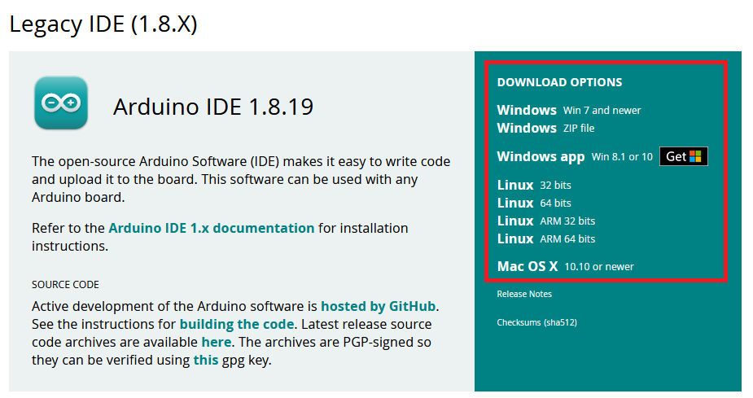
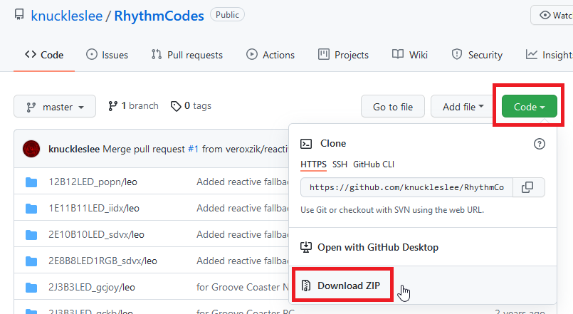
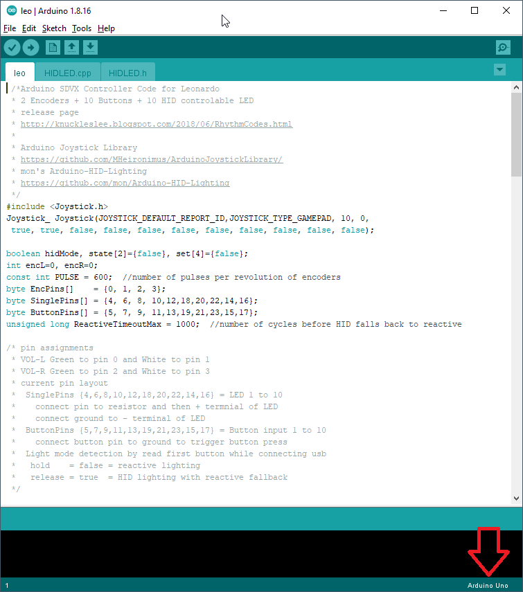
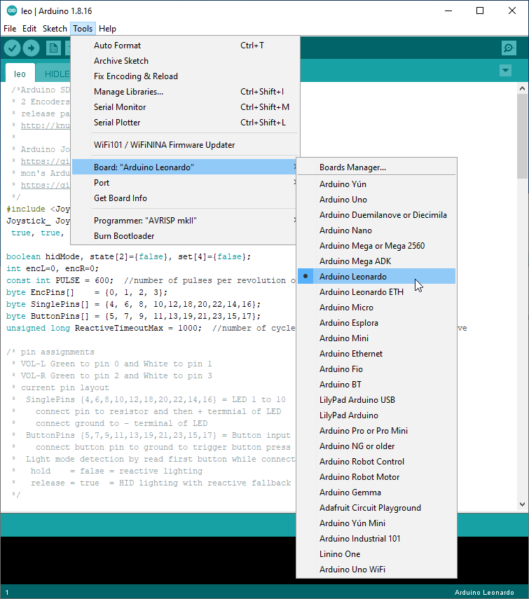
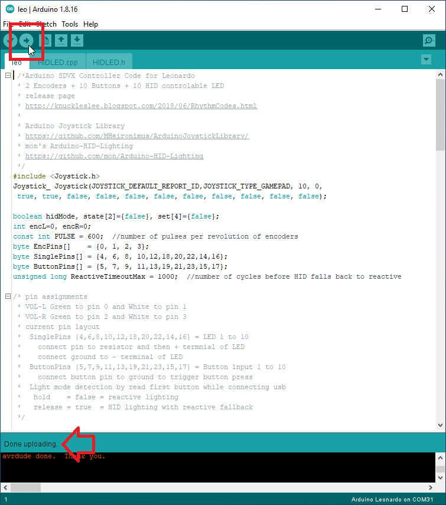
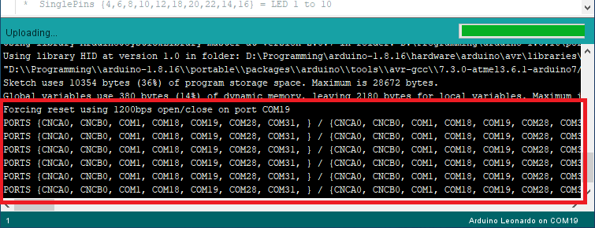

# Uploading to Arduino
{: .no_toc}

This page will walk you through step-by-step on how to set up the Arduino IDE and upload code to your Arduino for the first time! 

  

    Contents
  

  {: .text-delta }
1. TOC
{:toc}

## Step 1: Download the Arduino IDE

Navigate to the [Arduino Downloads Page](https://www.arduino.cc/en/software) and click on the right side for your OS. 

{: .note}
My recommendation is to scroll down and select 1.8.19. I've had relatively poor experience with the 2.X versions of the IDE. The rest of this walkthrough uses 1.8.19 in its screenshots. 

After downloading, install the IDE.

### Optional: Portable Mode

The author of this article (me) prefers to run Arduino in portable mode, which requires no installation and saves all of your settings within the same directory. To do so, download the ZIP file, extract, and then create an empty folder called "portable". When you run the .EXE, all of your settings will be saved to this folder. 

## Step 2: Download the code

You will find many codebases available on Github. There is a list of commonly used code on the Controller Code page.

In this example, we will be using KnucklesLee's code, but they will all work the same way.

Locate the green "Code" button, click it, and then click "Download ZIP". 

Then, unzip the file. 

### Step 2b: Additional Libraries

Look through the README of your chosen code carefully. Some may require additional libraries to be installed.

Common libraries are: 

* [Bounce2](https://github.com/thomasfredericks/Bounce2), which may be installed directly from the Arduino Library Manager (Tools -> Manage Libraries...).
* [Arduino Joystick Library](https://github.com/MHeironimus/ArduinoJoystickLibrary), which has separate install instructions in its README. This library is required for KnucklesLee's code.

## Step 3: Open the IDE and your code

Run the Arduino IDE, select File -> Open, and locate your code. Select the file with the *.INO file extension.

It will look something like this: 

Please note the board in the lower right, as indicated by the red arrow. This must match the board you are attempting to program to.

## Step 4: Select the port

Plug in your Arduino. Then under Tools -> Port, select the COMxx number that matches your board. It should be labeled. 

## Step 5: Upload!

Press the Upload button, located in the upper left of the screen. It is an arrow pointing to the right. When the upload is finished, the words "Done Uploading." will appear in the lower portion of the screen. 

### Step 5b: Troubleshooting

If the upload fails, first go to "File -> Preferences" and ensure the "Upload" checkbox is selected next to the "Show verbose output during:" option. 

Then, examine the console output, shown in red text on a black background.

If the following message is spamming, double check the port number selected in Step 4. If this is correct, reset the Arduino using the Red reset button (Leonardo / Micro) or by double tapping the RST pin to GND (Pro Micro) using a piece of wire. Reset **must** be pressed while this message is occurring. If it is done before or after, the board will not upload. 

