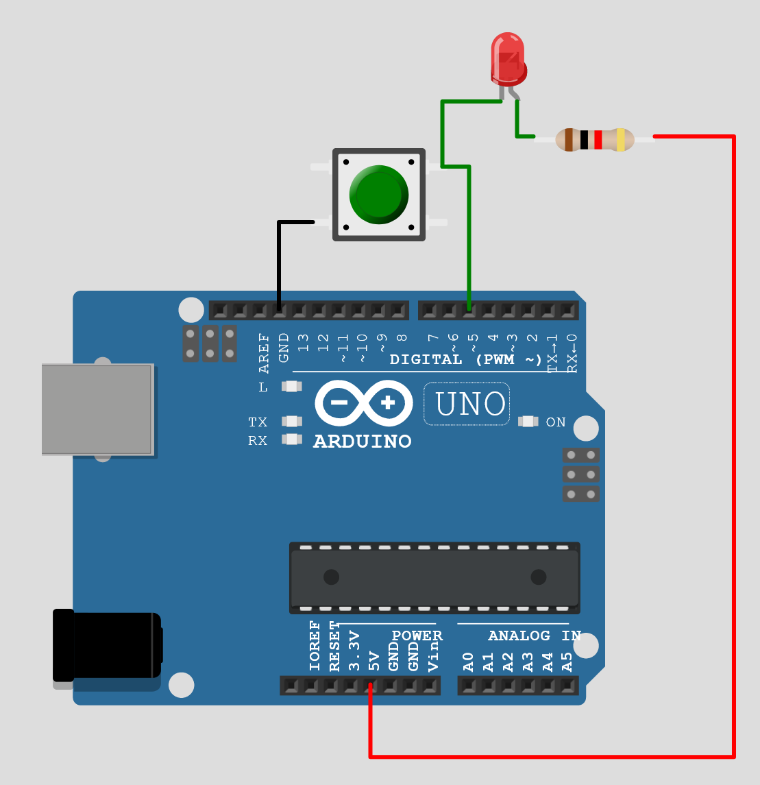
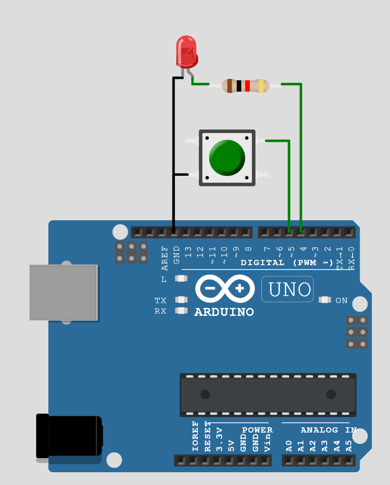

# Wiring LEDs

This page discusses methods on wiring LEDs to microcontrollers. It is recommended you read [Electronics Basics](./electronics-basics.md) first if you are new to electronics. 

## Current Limiting Resistors

LEDs inherently have no method to control the amount of current that flows through them. If plugged directly into power, they will continue to draw current until they heat up and burn out.

To prevent this, current limiting resistors are used to restrict the current to a known value.

To calculate the correct resistor, three (3) parameters are required:
1. Value of the voltage source (in Volts)
2. Forward voltage of the LED (in Volts)
3. Typical current draw of the LED (in Amps)

If you do not wish to calculate values for each color LED, 220 ohm is a safe value to use for nearly all LEDs. 

### Example

Using an Arduino Pro Micro with 5V voltage source, a red LED with a 1.8V forward voltage, and a target current of 20mA (or 0.020A):

R = (Vsource - Vforward) / ILED = (5.0 - 1.8) / 0.02 = 160 ohm

160 ohm is not a common resistor value, so we will go up to the next possible one, which is 180 ohm. 

## General Notes

1. The position of the resistor and LED can be swapped, it does not matter which order they are connected it.
2. LEDs are polarized components, which means it does matter which side is connected to power and which side is connected to ground. It will not damage the LED to wire them backwards, so don't worry about getting it wrong.

## Types of Wiring

### Reactive

With **Reactive** wiring, the LED turns on when the button is pressed, and turns off when the button is released. It is not possible to control the LED via software.

This will only require one pin on the Arduino per button.

An example of how to wire reactive lighting is shown below.

### HID Controlled

With **HID Controlled** wiring, the microcontroller is able to control the LED on and off via software.

Both of the options below will require two pins on the Arduino per button. 

#### Direct Drive

With direct drive, the microcontroller sources or sinks the LED directly from its pin. A typical Arduino can source / sink 30mA per pin, which is an acceptable amount of current for most LEDs.

An example of how to wire reactive lighting is shown below.

#### Mosfet Drive

For driving high-current LEDs or driving LEDs with a voltage higher than your microcontroller can output, you can control the LED with a mosfet.

Mosfets have a few key features to select:

1. Type (NPN or PNP)
2. Maximum current1. 
3. On-Resistance1. 